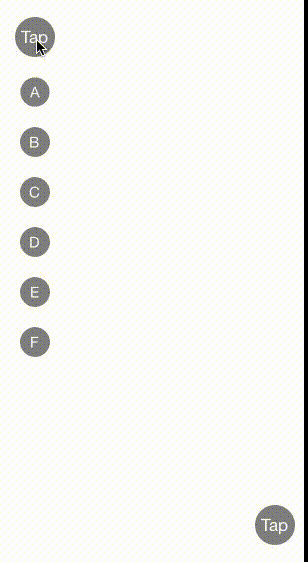

DWBubbleMenuButton
==================



DWBubbleMenuButton is a simple animation framework for expanding and collapsing a variable sized menu. Project allows for expanding menus in left, right, up, and down directions. Using the framework is as simple as setting your home button and adding an array of menu buttons.

Usage
==================
Create a home a button
```
    UIButton *menuButton = [UIButton buttonWithType:UIButtonTypeSystem];

    [menuButton setTitle:@"Menu" forState:UIControlStateNormal];
```

Create an instance of DWBubbleMenuButton
```
    DWBubbleMenuButton *bubbleMenuButton = [[DWBubbleMenuButton alloc] initWithFrame:CGRectMake(20.f,
                                                                                            20.f,
                                                                                            100.f,
                                                                                            100.f)
                                                              expansionDirection:DirectionDown];
    bubbleMenuButton.homeButtonView = menuButton;
```

Add buttons to your bubble menu
```
    [bubbleMenuButton addButtons:@[ /* your buttons */]];
    
    /* Or */
    
    [bubbleMenuButton addButton:/* your button */];
```
